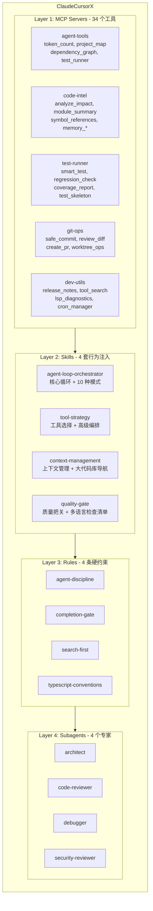
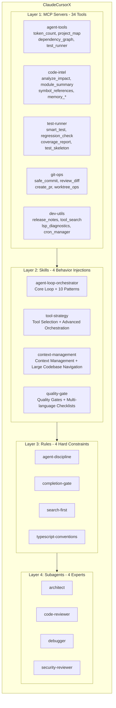

# ClaudeCursorX

**让 Cursor IDE 拥有类似 Claude Code 的 Agent 能力**

[English](#english) | [中文](#中文)

---

<a id="中文"></a>

## 简介

ClaudeCursorX 是一个开箱即用的 Cursor IDE 增强工具包。通过 **MCP Server + Skills + Rules + Subagents** 四层架构，为 Cursor 注入接近 Claude Code 水平的智能编码能力。

这不是 Claude Code 的复刻——它是针对 Cursor 架构特点的原生增强方案，经过对 Claude Code 源码的深度分析后设计而成。

## 架构



## 功能清单

### MCP Servers (34 个工具)

| Server | 工具 | 功能 |
|--------|------|------|
| **agent-tools** | `token_count` | 估算文本 token 数量 |
| | `project_map` | 生成项目结构地图 |
| | `dependency_graph` | 分析模块依赖关系 |
| | `test_runner` | 运行测试用例 |
| **code-intel** | `analyze_impact` | 分析代码变更影响范围 |
| | `module_summary` | 生成模块摘要 |
| | `find_test_coverage` | 查找测试覆盖情况 |
| | `symbol_references` | 查找符号引用 |
| | `dependency_graph` | 依赖关系分析 |
| | `project_overview` | 项目概览 |
| | `memory_save` | 保存决策记忆到持久化文件 |
| | `memory_search` | 搜索历史记忆 |
| | `memory_read` | 读取所有记忆 |
| | `team_memory_sync` | 团队记忆 Git 同步 |
| | `team_memory_save` | 保存团队共享记忆 |
| **test-runner** | `smart_test` | 智能测试（自动检测框架） |
| | `regression_check` | 回归测试检查 |
| | `test_skeleton` | 生成测试骨架代码 |
| | `test_report` | 生成测试报告 |
| | `coverage_report` | 测试覆盖率报告 |
| **git-ops** | `safe_commit` | 安全提交（带预检查） |
| | `review_diff` | 代码差异审查 |
| | `create_pr` | 创建 Pull Request |
| | `stash_switch` | Stash 管理与分支切换 |
| | `worktree_ops` | Git Worktree 操作 |
| | `branch_status` | 分支状态总览 |
| **dev-utils** | `release_notes` | 基于 git log 生成发布说明 |
| | `tool_search` | 搜索所有可用 MCP 工具 |
| | `workflow_runner` | 工作流管理 |
| | `terminal_capture` | 终端输出捕获 |
| | `config_manager` | 项目配置管理 |
| | `cron_manager` | 简易定时任务 |
| | `lsp_diagnostics` | LSP 深度诊断 |
| | `prompt_suggestion` | 智能后续步骤建议 |

### Skills (4 套)

| Skill | 描述 | 文件 |
|-------|------|------|
| **agent-loop-orchestrator** | 核心 Agent 循环逻辑，包含 10 种高级模式（深度审查、子 Agent 协调、会话引导等） | `SKILL.md` + `patterns.md` |
| **tool-strategy** | 工具选择策略和高级编排模式（并行搜索、大文件处理、上下文复用） | `SKILL.md` + `advanced-patterns.md` |
| **context-management** | 上下文 token 预算管理，大型代码库高效导航策略 | `SKILL.md` + `large-codebase-guide.md` |
| **quality-gate** | 质量把关流程，包含 TypeScript/Python/Rust 等多语言检查清单 | `SKILL.md` + `checklists.md` |

### Rules (4 条)

| Rule | 作用 | 生效范围 |
|------|------|----------|
| **agent-discipline** | 读后写、改后查、禁止盲改 | 所有文件 |
| **completion-gate** | 完成前必须验证 + 记忆提取 | 所有文件 |
| **search-first** | 搜索优先于全文读取 | 所有文件 |
| **typescript-conventions** | TypeScript 编码规范 | `*.ts, *.tsx` |

### Subagents (4 个)

| Agent | 专长 | 触发场景 |
|-------|------|----------|
| **architect** | 架构设计与技术决策 | 大型功能规划、系统设计 |
| **code-reviewer** | 代码审查 | 代码修改后、PR 前 |
| **debugger** | 调试与问题诊断 | 运行时错误、测试失败 |
| **security-reviewer** | 安全审计 | 认证/加密/输入处理相关变更 |

## 安装

### 前置条件

- [Cursor IDE](https://cursor.sh/) (最新版)
- Python 3.10+
- pip

### 方式一：一键安装

```bash
git clone https://github.com/YOUR_USERNAME/ClaudeCursorX.git
cd ClaudeCursorX

# 安装到目标项目（复制模式）
./install.sh /path/to/your/project

# 或使用 symlink 模式（toolkit 更新时目标项目自动同步）
./install.sh --link /path/to/your/project
```

### 方式二：手动安装

1. 克隆本仓库：

```bash
git clone https://github.com/YOUR_USERNAME/ClaudeCursorX.git
```

2. 复制所需组件到目标项目的 `.cursor/` 目录：

```bash
# MCP Servers
cp -r ClaudeCursorX/mcp-servers/ your-project/.cursor/mcp-servers/

# Skills
cp -r ClaudeCursorX/skills/ your-project/.cursor/skills/

# Rules
cp -r ClaudeCursorX/rules/ your-project/.cursor/rules/

# Subagents
cp -r ClaudeCursorX/agents/ your-project/.cursor/agents/
```

3. 复制 MCP 配置：

```bash
cp ClaudeCursorX/templates/mcp.json your-project/.cursor/mcp.json
```

4. 安装 Python 依赖：

```bash
pip install -r ClaudeCursorX/requirements.txt
```

### 方式三：按需选装

```bash
# 只装 MCP Servers
./install.sh --mcp-only /path/to/your/project

# 只装 Skills
./install.sh --skills-only /path/to/your/project

# 只装 Rules
./install.sh --rules-only /path/to/your/project

# 只装 Subagents
./install.sh --agents-only /path/to/your/project
```

## 使用说明

### 安装后立即生效

- **Rules** 和 **Skills** 在 Cursor 打开项目时自动加载
- **MCP Servers** 根据 `.cursor/mcp.json` 自动启动
- **Subagents** 在需要时由 Cursor 按需调用

### 使用 MCP 工具

在 Cursor 对话中直接调用：

```
帮我分析这次代码变更的影响范围
→ Cursor 会自动调用 analyze_impact 工具

运行回归测试
→ Cursor 会自动调用 regression_check 工具

生成这个版本的发布说明
→ Cursor 会自动调用 release_notes 工具
```

### 记忆系统

工具包内置了跨会话记忆持久化能力：

- **个人记忆**: `memory_save` / `memory_search` / `memory_read` — 保存在项目 `.cursor/memory.md`
- **团队记忆**: `team_memory_save` / `team_memory_sync` — 保存在 `.cursor/team-memory/`，通过 Git 同步

### 自定义扩展

#### 添加新 Rule

在 `rules/` 目录创建 `.mdc` 文件：

```yaml
---
description: Your rule description
alwaysApply: true
---

# Your Rule Name

1. Rule content...
```

#### 添加新 Skill

在 `skills/` 目录创建子目录和 `SKILL.md`：

```
skills/
└── my-skill/
    ├── SKILL.md          # 主文件（每轮注入）
    └── details.md        # 补充文件（按需读取）
```

#### 添加新 Subagent

在 `agents/` 目录创建 `.md` 文件：

```yaml
---
name: my-agent
description: >-
  What this agent does and when to use it.
---

Your agent system prompt here...
```

## 设计背景

本项目源于对 [Claude Code](https://docs.anthropic.com/en/docs/claude-code) 源码的深度分析。Claude Code 是 Anthropic 推出的 CLI 编码助手，拥有完整的 Agent Loop、40+ 工具、多 Agent 协调等能力。

我们分析了 Claude Code 的核心架构，识别出可以在 Cursor 中复现的能力边界，并设计了这套四层增强方案。详细分析文档见 `docs/` 目录：

| 文档 | 内容 |
|------|------|
| [ANALYSIS.md](docs/ANALYSIS.md) | Claude Code 源码架构分析 |
| [SKILL-ANALYSIS.md](docs/SKILL-ANALYSIS.md) | Skill 方案设计分析 |
| [MULTI-AGENT-ANALYSIS.md](docs/MULTI-AGENT-ANALYSIS.md) | 多 Agent 可行性分析 |
| [GAP-ANALYSIS.md](docs/GAP-ANALYSIS.md) | Claude Code vs Cursor 差距分析 |
| [PLUGIN-ECOSYSTEM-ANALYSIS.md](docs/PLUGIN-ECOSYSTEM-ANALYSIS.md) | Claude Code 插件生态系统分析（v2.1.91） |

## 项目结构

```
ClaudeCursorX/
├── README.md              # 本文件
├── LICENSE                # GPL 3.0
├── install.sh             # 一键安装脚本
├── requirements.txt       # Python 依赖
├── mcp-servers/           # 5 个 MCP Server（34 个工具）
│   ├── agent-tools/       # 基础工具：token 计数、项目地图、依赖图、测试
│   ├── code-intel/        # 代码智能：影响分析、符号引用、记忆系统
│   ├── test-runner/       # 测试增强：智能测试、回归检查、覆盖率
│   ├── git-ops/           # Git 操作：安全提交、PR、Worktree
│   └── dev-utils/         # 开发工具：发布说明、LSP、工作流、配置
├── skills/                # 4 套 Skill（行为注入）
├── rules/                 # 4 条 Rule（硬约束）
├── agents/                # 4 个 Subagent（专家角色）
├── docs/                  # 设计分析文档
└── templates/             # 配置模板
    └── mcp.json
```

## 贡献

欢迎贡献！请通过以下方式参与：

1. Fork 本仓库
2. 创建特性分支 (`git checkout -b feature/amazing-tool`)
3. 提交变更 (`git commit -m 'Add amazing tool'`)
4. 推送分支 (`git push origin feature/amazing-tool`)
5. 创建 Pull Request

### 贡献方向

- 新增 MCP 工具（新的 Server 或在现有 Server 中添加工具）
- 新增 Skill 或改进现有 Skill 的模式
- 新增 Rule（其他语言的编码规范等）
- 新增 Subagent（如 performance-profiler、docs-writer 等）
- 改进安装脚本（支持 Windows、支持更多 Shell）
- 完善文档和使用示例

## 许可证

本项目采用 [GPL 3.0](LICENSE) 许可证。

---

<a id="english"></a>

## English

### Introduction

ClaudeCursorX is a ready-to-use enhancement toolkit for Cursor IDE. Through a four-layer architecture of **MCP Servers + Skills + Rules + Subagents**, it brings Claude Code-level intelligent coding capabilities to Cursor.

This is not a Claude Code clone — it's a native enhancement designed for Cursor's architecture, informed by deep analysis of Claude Code's source code.

### Architecture



### Feature List

#### MCP Servers (34 Tools)

| Server | Tool | Description |
|--------|------|-------------|
| **agent-tools** | `token_count` | Estimate token count for text |
| | `project_map` | Generate project structure map |
| | `dependency_graph` | Analyze module dependencies |
| | `test_runner` | Run test cases |
| **code-intel** | `analyze_impact` | Analyze code change impact scope |
| | `module_summary` | Generate module summary |
| | `find_test_coverage` | Find test coverage information |
| | `symbol_references` | Find symbol references |
| | `dependency_graph` | Dependency analysis |
| | `project_overview` | Project overview |
| | `memory_save` | Save decision memory to persistent file |
| | `memory_search` | Search historical memory |
| | `memory_read` | Read all memories |
| | `team_memory_sync` | Team memory Git sync |
| | `team_memory_save` | Save team shared memory |
| **test-runner** | `smart_test` | Smart testing (auto-detect framework) |
| | `regression_check` | Regression test check |
| | `test_skeleton` | Generate test skeleton code |
| | `test_report` | Generate test report |
| | `coverage_report` | Test coverage report |
| **git-ops** | `safe_commit` | Safe commit (with pre-checks) |
| | `review_diff` | Code diff review |
| | `create_pr` | Create Pull Request |
| | `stash_switch` | Stash management and branch switching |
| | `worktree_ops` | Git Worktree operations |
| | `branch_status` | Branch status overview |
| **dev-utils** | `release_notes` | Generate release notes from git log |
| | `tool_search` | Search all available MCP tools |
| | `workflow_runner` | Workflow management |
| | `terminal_capture` | Terminal output capture |
| | `config_manager` | Project configuration management |
| | `cron_manager` | Simple scheduled tasks |
| | `lsp_diagnostics` | LSP deep diagnostics |
| | `prompt_suggestion` | Smart next-step suggestions |

#### Skills (4 Sets)

| Skill | Description | Files |
|-------|-------------|-------|
| **agent-loop-orchestrator** | Core Agent loop logic with 10 advanced patterns (deep review, sub-agent coordination, session guidance, etc.) | `SKILL.md` + `patterns.md` |
| **tool-strategy** | Tool selection strategies and advanced orchestration patterns (parallel search, large file handling, context reuse) | `SKILL.md` + `advanced-patterns.md` |
| **context-management** | Context token budget management, efficient navigation strategies for large codebases | `SKILL.md` + `large-codebase-guide.md` |
| **quality-gate** | Quality gate workflow with multi-language checklists for TypeScript/Python/Rust and more | `SKILL.md` + `checklists.md` |

#### Rules (4 Rules)

| Rule | Purpose | Scope |
|------|---------|-------|
| **agent-discipline** | Read-before-write, verify-after-change, no blind edits | All files |
| **completion-gate** | Must verify + extract memory before completion | All files |
| **search-first** | Search before full-file reading | All files |
| **typescript-conventions** | TypeScript coding conventions | `*.ts, *.tsx` |

#### Subagents (4 Agents)

| Agent | Specialty | Trigger Scenarios |
|-------|-----------|-------------------|
| **architect** | Architecture design and technical decisions | Large feature planning, system design |
| **code-reviewer** | Code review | After code changes, before PR |
| **debugger** | Debugging and problem diagnosis | Runtime errors, test failures |
| **security-reviewer** | Security audit | Changes related to auth/encryption/input handling |

### Installation

#### Prerequisites

- [Cursor IDE](https://cursor.sh/) (latest)
- Python 3.10+
- pip

#### Option 1: One-click Install

```bash
git clone https://github.com/YOUR_USERNAME/ClaudeCursorX.git
cd ClaudeCursorX

# Install to target project (copy mode)
./install.sh /path/to/your/project

# Or use symlink mode (auto-sync when toolkit updates)
./install.sh --link /path/to/your/project
```

#### Option 2: Manual Install

1. Clone this repository:

```bash
git clone https://github.com/YOUR_USERNAME/ClaudeCursorX.git
```

2. Copy the desired components to the target project's `.cursor/` directory:

```bash
# MCP Servers
cp -r ClaudeCursorX/mcp-servers/ your-project/.cursor/mcp-servers/

# Skills
cp -r ClaudeCursorX/skills/ your-project/.cursor/skills/

# Rules
cp -r ClaudeCursorX/rules/ your-project/.cursor/rules/

# Subagents
cp -r ClaudeCursorX/agents/ your-project/.cursor/agents/
```

3. Copy MCP configuration:

```bash
cp ClaudeCursorX/templates/mcp.json your-project/.cursor/mcp.json
```

4. Install Python dependencies:

```bash
pip install -r ClaudeCursorX/requirements.txt
```

#### Option 3: Selective Install

```bash
# MCP Servers only
./install.sh --mcp-only /path/to/your/project

# Skills only
./install.sh --skills-only /path/to/your/project

# Rules only
./install.sh --rules-only /path/to/your/project

# Subagents only
./install.sh --agents-only /path/to/your/project
```

### Usage

#### Works Immediately After Install

- **Rules** and **Skills** are automatically loaded when Cursor opens the project
- **MCP Servers** start automatically based on `.cursor/mcp.json`
- **Subagents** are invoked on-demand by Cursor when needed

#### Using MCP Tools

Call them directly in Cursor conversations:

```
Analyze the impact of this code change
→ Cursor will automatically call the analyze_impact tool

Run regression tests
→ Cursor will automatically call the regression_check tool

Generate release notes for this version
→ Cursor will automatically call the release_notes tool
```

#### Memory System

The toolkit includes built-in cross-session memory persistence:

- **Personal Memory**: `memory_save` / `memory_search` / `memory_read` — stored in `.cursor/memory.md`
- **Team Memory**: `team_memory_save` / `team_memory_sync` — stored in `.cursor/team-memory/`, synced via Git

### Customization

#### Adding a New Rule

Create a `.mdc` file in the `rules/` directory:

```yaml
---
description: Your rule description
alwaysApply: true
---

# Your Rule Name

1. Rule content...
```

#### Adding a New Skill

Create a subdirectory with `SKILL.md` in the `skills/` directory:

```
skills/
└── my-skill/
    ├── SKILL.md          # Main file (injected each turn)
    └── details.md        # Supplementary file (read on demand)
```

#### Adding a New Subagent

Create a `.md` file in the `agents/` directory:

```yaml
---
name: my-agent
description: >-
  What this agent does and when to use it.
---

Your agent system prompt here...
```

### Design Background

This project originated from a deep analysis of [Claude Code](https://docs.anthropic.com/en/docs/claude-code)'s source code. Claude Code is Anthropic's CLI coding assistant with a complete Agent Loop, 40+ tools, multi-agent coordination, and more.

We analyzed the core architecture of Claude Code, identified the capability boundaries that can be replicated within Cursor, and designed this four-layer enhancement. See the `docs/` directory for detailed analysis:

| Document | Content |
|----------|---------|
| [ANALYSIS.md](docs/ANALYSIS.md) | Claude Code source architecture analysis |
| [SKILL-ANALYSIS.md](docs/SKILL-ANALYSIS.md) | Skill design analysis |
| [MULTI-AGENT-ANALYSIS.md](docs/MULTI-AGENT-ANALYSIS.md) | Multi-agent feasibility analysis |
| [GAP-ANALYSIS.md](docs/GAP-ANALYSIS.md) | Claude Code vs Cursor gap analysis |
| [PLUGIN-ECOSYSTEM-ANALYSIS.md](docs/PLUGIN-ECOSYSTEM-ANALYSIS.md) | Claude Code plugin ecosystem analysis (v2.1.91) |

### Project Structure

```
ClaudeCursorX/
├── README.md              # This file
├── LICENSE                # GPL 3.0
├── install.sh             # One-click install script
├── requirements.txt       # Python dependencies
├── mcp-servers/           # 5 MCP Servers (34 tools)
│   ├── agent-tools/       # Basic tools: token count, project map, dependency graph, testing
│   ├── code-intel/        # Code intelligence: impact analysis, symbol references, memory system
│   ├── test-runner/       # Test enhancement: smart testing, regression check, coverage
│   ├── git-ops/           # Git operations: safe commit, PR, Worktree
│   └── dev-utils/         # Dev utilities: release notes, LSP, workflow, config
├── skills/                # 4 Skills (behavior injection)
├── rules/                 # 4 Rules (hard constraints)
├── agents/                # 4 Subagents (expert roles)
├── docs/                  # Design analysis documents
└── templates/             # Configuration templates
    └── mcp.json
```

### Contributing

Contributions are welcome! Here's how to participate:

1. Fork this repository
2. Create a feature branch (`git checkout -b feature/amazing-tool`)
3. Commit your changes (`git commit -m 'Add amazing tool'`)
4. Push the branch (`git push origin feature/amazing-tool`)
5. Create a Pull Request

#### Contribution Areas

- Add new MCP tools (new servers or tools in existing servers)
- Add new Skills or improve existing Skill patterns
- Add new Rules (coding conventions for other languages, etc.)
- Add new Subagents (e.g., performance-profiler, docs-writer, etc.)
- Improve the install script (Windows support, more shells)
- Improve documentation and usage examples

### License

This project is licensed under [GPL 3.0](LICENSE).
